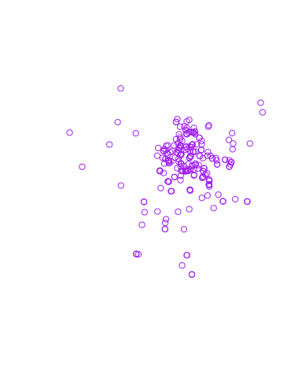

Interactive Maps with R
================
Alex Mandel, Nistara Randhawa, Ryan Peek, Mahesh Maskey
January 30, 2019

Introduction
============

-   What is an Interactive Map?
    -   A map that allows you to pan, zoom, and query(click) in the plot without additional code, or plotting. Also known as Slippy Maps, Dynamic Maps, etc...
-   When should I use an Interactive Map?
    -   Data and result exploration.
-   When should I not use an Interactive Map?
    -   When your map will be viewed in anything other than a web browser.
    -   When you don't need the viewer to be able to pan, zoom, and click on things in the map.

<!-- -->

    ## Loading required package: methods



[Interactive Map of the same data](https://r-spatial.github.io/mapview/articles/articles/mapview_01-basics.html)

Goal
----

Give people an dive into how to make interactive plots in R with maps. Focus on maps that allow the user to pan, zoom, query(click).

### Core tools

Mapview & Leaflet Packages

Mapview wraps Leaflet, making it simpler to use. You can use anything from leaflet as additional arguments to Mapview.

Tutorial
========

Exercise 1
----------

Mapview [Article 1](https://r-spatial.github.io/mapview/articles/articles/mapview_01-basics.html)

Note: the background may not show up in Rstudio, but if you open the file in browser it will.

Exercise 2
----------

Mapview [Article 2](https://r-spatial.github.io/mapview/articles/articles/mapview_02-advanced.html)

### Basemaps

If you want to use a different Basemap (Background Map), here's a list of easy to use examples. <http://leaflet-extras.github.io/leaflet-providers/preview/index.html> You can use any other XYZ tile service, read the documentation on how.

Other Tips
----------

### Labels

There's a bunch of different methods for labels, [read more](https://rdrr.io/cran/mapview/man/addStaticLabels.html)

``` r
library(leaflet)
library(mapview)

# Turn on labels to start
lopt = labelOptions(noHide = TRUE,
                    direction = 'top',
                    textOnly = TRUE)


# Point labels
m1 = mapview(breweries)
l1 = addStaticLabels(m1,
                     label = breweries$brewery,
                     labelOptions = lopt)
#l1

# Polygon Labels
m2 = mapview(franconia)
l2 = addStaticLabels(m2,
                     label = franconia$NAME_ASCI,
                     labelOptions = lopt)
#l2

# Custom labels
m3 = m2 + m1
l3 = addStaticLabels(m3,
                     data = franconia,
                     label = franconia$NAME_ASCI,
                     labelOptions = lopt)
#l3
```

### Scale Bar

Adding a Scale Bar to the Map

``` r
# Take an existing map object and add a scale bar
m2 <- addMeasure(l3)
#m2
```

### Saving your map

You can also save the interactive map to an HTML file which you can share with others.

``` r
m2 = mapview(franconia)
mapshot(m2, "franconia.html")
```

If you used `leaflet` for your interactive map, you would use `saveWidget` from the `htmlwidgets` package.

``` r
library(leaflet)
library(htmlwidgets)
data(quakes)

# Map first 20 rows from the `quakes` dataset
quake_map = leaflet(data = quakes[1:20,]) %>%
    addTiles() %>%
    addMarkers(~long, ~lat, popup = ~as.character(mag))

saveWidget(quake_map, "quakes.html")
```

Outline
=======

Data Types
----------

-   Points, Lines, Polygons, Rasters
-   Vectors include the option for popups from attribute tables
-   sp and sf

Data Examples
-------------

-   Crop Field Boundaries (polygons) with UAS RGB and NDVI rasters (From Taylors presentation last quarter), it could be crop type
-   Getting country/administrative boundaries (polygons) via R and using them in Leaflet. Useful when working with health data or any field project in different countries
-   Climate data

Steps
-----

-   Data Preparation
-   Decide how to derive data
-   Dealing with missing data
-   Compile them at a point wise

Styling
-------

-   Points - circles vs markers, their attributes, using custom icons, etc
-   Lines
-   Polygons
-   Rasters
-   Basemaps
-   Standard - OSM, Bing, Google,
-   XYZ tiles - i.e. Stamen, etc
-   Transparency
-   Labels
-   Attribute pop-ups
-   Toggle different data layers on the map
-   Tools that allow measurement/point extraction (Javascript based but easy to drop code in to play with (Leaflet))

Bonus
-----

Exporting to share with others (HTML or Shiny)

References
----------

-   <https://rstudio.github.io/leaflet/>
-   <https://r-spatial.github.io/mapview/>
