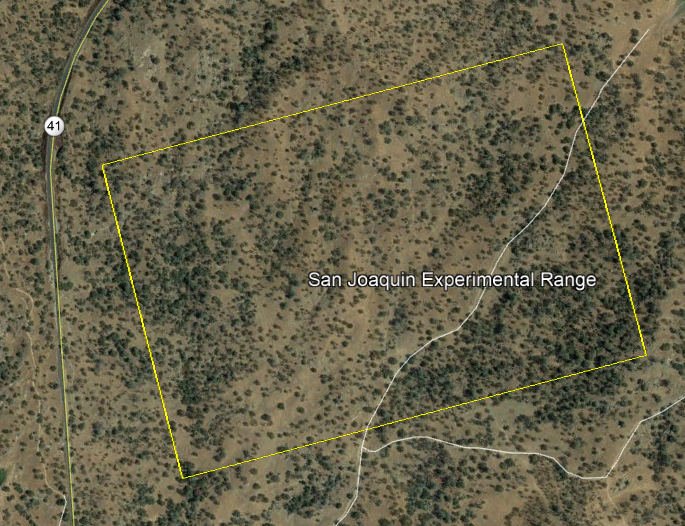
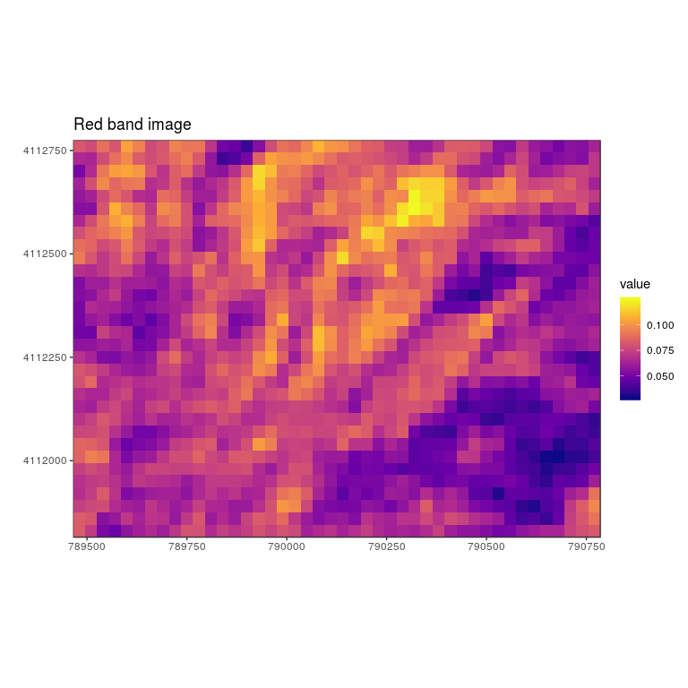
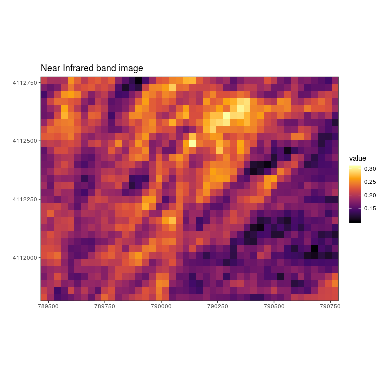
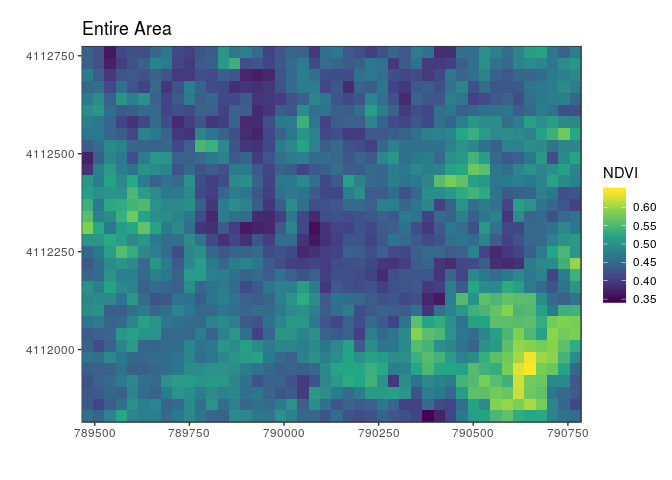
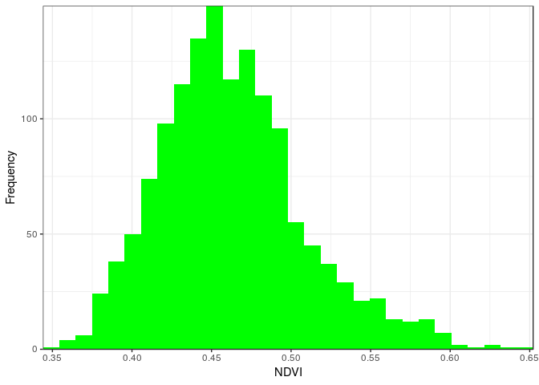
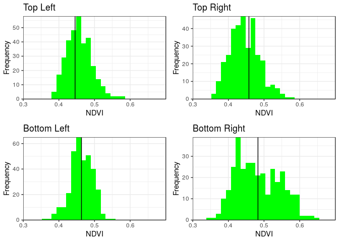

Normalized Difference Vegetation Index (NDVI) Time Series Data in R
================
Mahesh L Maskey, Kristen Shapiro
April 23, 2019

-   [Introduction](#introduction)
-   [Landsat Image](#landsat-image)
    -   [Why landsat images](#why-landsat-images)
    -   [Downloading Landsat images](#downloading-landsat-images)
-   [Method](#method)
    -   [Study Area](#study-area)
    -   [Raster Data](#raster-data)
    -   [R and R Markdown](#r-and-r-markdown)
-   [Pertinent Tools and Functions](#pertinent-tools-and-functions)
    -   [Libraries](#libraries)
    -   [Custumized Functions](#custumized-functions)
-   [Tutoral 1: A Single Multiband Raster Image](#tutoral-1-a-single-multiband-raster-image)
    -   [Loading and Visualizing](#loading-and-visualizing)
    -   [Stacked Rasters](#stacked-rasters)
    -   [Raster Visualization](#raster-visualization)
    -   [Sample NDVI Calculation](#sample-ndvi-calculation)
-   [Tutorial 2: Temporal Analysis](#tutorial-2-temporal-analysis)
    -   [Loading Rasters and NDVI Time Series](#loading-rasters-and-ndvi-time-series)
    -   [NDVI Time Series Data](#ndvi-time-series-data)
    -   [Temporal Dynamics](#temporal-dynamics)
-   [Tutorial 3: Spatial Analysis](#tutorial-3-spatial-analysis)
    -   [Raster Extent](#raster-extent)
    -   [Croping Extent](#croping-extent)
    -   [Spatial Variability](#spatial-variability)

Introduction
============

In order to quantify live vegetation within any area, an indicator, which uses the visible and near-infrared bands of the electromagnetic spectrum called the Normalized Difference Vegetation Index (NDVI), has been popularized for a wide variety of projects after the invent of remote sensing measurements

Until now, such index has been derived using spatial analysis of GIS packages especially at a specific site and time. Moreover, such has been done manually. In addition, such information gathering over different time scales are not also available yet. In this regard, this workshop presents how NDVI can be derived using open source codes related to R-spatial packages. Further, this exercise demonstrates how such information can automatically be derived and extracts in a time series format. It will also present an exercise to discretize the raster map into different areas of interest, revealing the evolution of NDVI distribution over a given location.

While NDVI information is very useful in various field of studies like agriculture, crop yield, land cover change, plant phenology, climate change, seasonal change and beyond, this workshop has been set up with following objectives:

-   to learn how to manipulate remotely sensed images to extract physical quantities like NDVI
-   to visualize rsater images and relevant statistics
-   to perform sample raster calculations
-   to extract NDVI time series from deifferent periods of obesevation
-   to visualize spatial dynamics

Landsat Image
=============

Why landsat images
------------------

Since 1972 the Landsat Mission has been collecting imagery of earth. This archive of data is free to access and provides researchers with an invaluable resource of continuous coverage for their study areas. Currently, Landsat 7 and Landsat 8 are in orbit and have a repeat interval of 16 days. The satellites’ orbits are offset to allow 8-day repeat coverage of any Landsat scene.

Downloading Landsat images
--------------------------

-   Go to www.earthexplorer.usgs.gov
-   If you do not have earth explorer account, register for an account, certain features are accessible without an account, but to download data an account is necessary.
-   Enter search criteria to define your area and dates of interest; if using a `shapefile`, the data must be uploaded as a `*.zip`
-   Under datasets you can choose which imagery archives to search through; note that earth explorer hosts more than just Landsat data.
-   Under the Landsat collection, you can choose which Landsat satellites you want to add to your search and which level of data processing you want for the imagery products. For this tutorial we used Collection 1 Level-2, Landsat 8 data. Level 2 imagery is processed to surface reflectance.
-   Under additional criteria you can further refine your search parameters. One example is to set limits on the amount of cloud cover you want to allow in any scene
-   Run the search by hitting the results button. This returns a set of images that meet your criteria. For each image you can view its metadata and display the footprint of the image tile over your area of interest.
-   Depending on which type of imagery you want to access, the download options will change. Landsat Collection-1 Level 2 data is generated on demand and must submitted as an order to USGS. You will receive an email when your imagery request has been fulfilled and is ready to download. If you are using the Landsat ARD (analysis ready data) Collection, this imagery is immediately available for download and can be downloaded individually or with the bulk download option.
-   Once you know which Landsat scenes you want to download there are other options you can explore to speed up the process. See: github.com/USGS-EROS/espa-bulk-downloader

Method
======

Study Area
----------

Our area of interest covers part of the San Joaquin Experimental Range which is located in the foothills of the Sierra Nevada in Coarsegold, Madera County, about 20 miles north of Fresno. San Joaquin contains open woodland dominated by oaks (blue and interior live oaks) and digger pine with scattered shrubs and nearly continuous cover of herbaceous plants.



Raster Data
-----------

For this workshop, we have already downloaded Landsat images and stored in `google drive` belong to UC Davis (below). Before the workshop make sure that all the files are under `Data` folder and also note that all the image files named with "YYYYmmdd.tif" format.

> Data URL <https://drive.google.com/a/ucdavis.edu/file/d/1TdyEqDOEnZ_9qUaF81CSFSkhO5n8GX6U/view?usp=sharing>

If you do not have `Data` folder in your machine where this this `rmd` file exists, create a folder and copy all the downloaded images into this folder.

R and R Markdown
----------------

Here, we mostly use RStudio interface except for downloading Landsat imagery files. Our purpose is to use simple and widely used open source library as much as possible. This workshop, entirely, will be done using R-Markdown because R Markdown documents are fully reproducible. Moreover, it allows you to see narrative text and code and preview on table and figures in an elegantly formatted version. It also allows us to save in `html` or `pdf` format. To learn more about `R Markdown`, refer to <https://rmarkdown.rstudio.com/>

> Get the code from teh Data.zip linked above or directly [from the R-Markdown Source Code on github](https://raw.githubusercontent.com/MicheleTobias/MaptimeDavis/master/Rspatial/NDVI-TimeSeriesR/NDVI-TimeSeriesR.Rmd) When it opens, use File -&gt; Save As (Ctrl-S) to save the file to your computer and open it in RStudio

This workshop covers: (a) importing the raster data; (b) visualizing the rater data; (c) performing raster calculation and (d) investigating temporal and spatial dynamics.

Pertinent Tools and Functions
=============================

Libraries
---------

``` r
library(raster)
library(sp)
library(rgdal)
library(ggplot2)
library(ggpubr)
library(scales)
```

Custumized Functions
--------------------

Here are some functions for this workshop.

``` r
NDVI <- function(X, Y){
  # generates raster of given two bands
  #X: Near infrared band Image
  #Y: Red band Image
  ndvi <- (X-Y)/(X+Y)
  return(ndvi)
}

ggrasterPlot <- function(imgRaster, valueStr, titleStr, colorScheme =  'inferno'){
  # routine to create raster plot using ggplot with required modifications
  #imgRaster:   raster image
  #valueStr:    define value to be analyzed
  #titleStr:    set of strings for title
  #colorScheme: color of image 
  imgRaster.df <- as.data.frame(imgRaster, xy = TRUE)
  colnames(imgRaster.df)<-c('x', 'y', valueStr)
  pltRaster<-ggplot(imgRaster.df, aes(x = x, y = y)) +
    geom_raster(data = imgRaster.df , aes_string(fill = valueStr)) +
    scale_fill_viridis_c(option = colorScheme) +
    scale_x_continuous(expand = c(0,0))+
    scale_y_continuous(expand = c(0,0))+
    xlab('') + ylab('')+
    coord_quickmap()+
    ggtitle(titleStr)+
  theme_bw()
  return(pltRaster)
}

ggrasterHist<- function(imgRaster, valueStr){
  # creates a histogram of raster using ggplot with required modifications
  #imgRaster:   raster image
  #valueStr:    define value to be analyzed
  imgRaster.df <- as.data.frame(imgRaster, xy = TRUE)
  colnames(imgRaster.df)<-c('x', 'y', valueStr)
  pltHist<-ggplot() +
    geom_histogram(data = imgRaster.df, aes_string(x=valueStr), fill='green')+
    xlab(valueStr) + ylab('Frequency')+
    scale_x_continuous(expand = c(0,0), limits = c(0.3,0.7))+
    scale_y_continuous(expand = c(0,0))+
    theme_bw()
  return(pltHist)
}

getcropArea<-function(X1,X2, Y1, Y2){
  # generates a set of coordinates for a ractangle to be plotted based on
  # X1, Y1: lower bound
  # X2, Y2: upper bound
  rectangle.df = data.frame(matrix(NaN, nrow = 5, ncol = 2))
  colnames(rectangle.df) = c('x', 'y')
  rectangle.df$x[c(1,4,5)] = X1
  rectangle.df$x[c(2,3)] = X2
  rectangle.df$y[c(1,2,5)] = Y1
  rectangle.df$y[c(3,4)] = Y2
  return(rectangle.df)
}

meanNDVI<- function(rasterNDVI){
  # calculates average NDVI over given raster
  dataMatrix <- rasterToPoints(rasterNDVI)
  return(mean(dataMatrix[,3], na.rm = TRUE))
}
```

Tutoral 1: A Single Multiband Raster Image
==========================================

The first part of our workshop will focus on a single image with following tasks:

-   how to read the multiband raster data
-   to extract individual band raster
-   to perform raster calculations
-   to visualize its statistics

In this first part, we will go through steps for calculation and visualization. In next part, we will mostly use customized functions.

Loading and Visualizing
-----------------------

A function `stack()` embedded in the `raster` package creates a `RasterStack`, a collection of `RasterLayer objects`. Here we use this function to read multiband raster image and then view the data structure. For this, we use one of the stored file `20180202.tif` under `Data` folder.

``` r
imageFileName = 'Data/20180202.tif'
raster1 <- stack(imageFileName)
raster1
```

    ## class       : RasterStack 
    ## dimensions  : 32, 44, 1408, 4  (nrow, ncol, ncell, nlayers)
    ## resolution  : 30, 30  (x, y)
    ## extent      : 789465, 790785, 4111815, 4112775  (xmin, xmax, ymin, ymax)
    ## coord. ref. : +proj=utm +zone=10 +datum=WGS84 +units=m +no_defs +ellps=WGS84 +towgs84=0,0,0 
    ## names       : X20180202.1, X20180202.2, X20180202.3, X20180202.4

Since there are multiple bands in the raster, we can check the number of layers using the `nlayers()` function.

``` r
nlayers(raster1)
```

    ## [1] 4

there are four bands each of which are:

``` r
raster1@layers
```

    ## [[1]]
    ## class       : RasterLayer 
    ## band        : 1  (of  4  bands)
    ## dimensions  : 32, 44, 1408  (nrow, ncol, ncell)
    ## resolution  : 30, 30  (x, y)
    ## extent      : 789465, 790785, 4111815, 4112775  (xmin, xmax, ymin, ymax)
    ## coord. ref. : +proj=utm +zone=10 +datum=WGS84 +units=m +no_defs +ellps=WGS84 +towgs84=0,0,0 
    ## data source : /home/vulpes/biogeo/spatialcenter/MaptimeDavis/Rspatial/NDVI-TimeSeriesR/Data/20180202.tif 
    ## names       : X20180202.1 
    ## 
    ## 
    ## [[2]]
    ## class       : RasterLayer 
    ## band        : 2  (of  4  bands)
    ## dimensions  : 32, 44, 1408  (nrow, ncol, ncell)
    ## resolution  : 30, 30  (x, y)
    ## extent      : 789465, 790785, 4111815, 4112775  (xmin, xmax, ymin, ymax)
    ## coord. ref. : +proj=utm +zone=10 +datum=WGS84 +units=m +no_defs +ellps=WGS84 +towgs84=0,0,0 
    ## data source : /home/vulpes/biogeo/spatialcenter/MaptimeDavis/Rspatial/NDVI-TimeSeriesR/Data/20180202.tif 
    ## names       : X20180202.2 
    ## 
    ## 
    ## [[3]]
    ## class       : RasterLayer 
    ## band        : 3  (of  4  bands)
    ## dimensions  : 32, 44, 1408  (nrow, ncol, ncell)
    ## resolution  : 30, 30  (x, y)
    ## extent      : 789465, 790785, 4111815, 4112775  (xmin, xmax, ymin, ymax)
    ## coord. ref. : +proj=utm +zone=10 +datum=WGS84 +units=m +no_defs +ellps=WGS84 +towgs84=0,0,0 
    ## data source : /home/vulpes/biogeo/spatialcenter/MaptimeDavis/Rspatial/NDVI-TimeSeriesR/Data/20180202.tif 
    ## names       : X20180202.3 
    ## 
    ## 
    ## [[4]]
    ## class       : RasterLayer 
    ## band        : 4  (of  4  bands)
    ## dimensions  : 32, 44, 1408  (nrow, ncol, ncell)
    ## resolution  : 30, 30  (x, y)
    ## extent      : 789465, 790785, 4111815, 4112775  (xmin, xmax, ymin, ymax)
    ## coord. ref. : +proj=utm +zone=10 +datum=WGS84 +units=m +no_defs +ellps=WGS84 +towgs84=0,0,0 
    ## data source : /home/vulpes/biogeo/spatialcenter/MaptimeDavis/Rspatial/NDVI-TimeSeriesR/Data/20180202.tif 
    ## names       : X20180202.4

Notice that there are three layers corresponding to blue, green, red and near infrared respectively. In order to calculate NDVI, we need two bands: red (third layer) and near infrared (fourth layer). So, we simply assign third element of `raster1` as `redBand` and fourth as `NIRBand`.

Stacked Rasters
---------------

``` r
redBand<- raster1[[3]]
redBand
```

    ## class       : RasterLayer 
    ## band        : 3  (of  4  bands)
    ## dimensions  : 32, 44, 1408  (nrow, ncol, ncell)
    ## resolution  : 30, 30  (x, y)
    ## extent      : 789465, 790785, 4111815, 4112775  (xmin, xmax, ymin, ymax)
    ## coord. ref. : +proj=utm +zone=10 +datum=WGS84 +units=m +no_defs +ellps=WGS84 +towgs84=0,0,0 
    ## data source : /home/vulpes/biogeo/spatialcenter/MaptimeDavis/Rspatial/NDVI-TimeSeriesR/Data/20180202.tif 
    ## names       : X20180202.3

``` r
NIRBand<- raster1[[4]]
NIRBand
```

    ## class       : RasterLayer 
    ## band        : 4  (of  4  bands)
    ## dimensions  : 32, 44, 1408  (nrow, ncol, ncell)
    ## resolution  : 30, 30  (x, y)
    ## extent      : 789465, 790785, 4111815, 4112775  (xmin, xmax, ymin, ymax)
    ## coord. ref. : +proj=utm +zone=10 +datum=WGS84 +units=m +no_defs +ellps=WGS84 +towgs84=0,0,0 
    ## data source : /home/vulpes/biogeo/spatialcenter/MaptimeDavis/Rspatial/NDVI-TimeSeriesR/Data/20180202.tif 
    ## names       : X20180202.4

Raster Visualization
--------------------

We can plot raster images individually just using `ggplot` embedded in the `ggplot2` package. For this, one needs to convert rater data to a dataframe. We can use the `as.data.frame` function to do this as the `raster` package has an built-in function for conversion to a plotable dataframe. So, let's view both raster data. Here, we rename `layer` attribute to `value` for simplicity while we rename the column names of this data frame. In this exercise, we just set the default values of color scale to `scale_fill_viridis_c()` and also to the `coord_quickmap()` functions. Former function provides colour maps that are perceptually uniform. We use `plasma` for `redBand` and `inferno` for `NIRBand`. `coord_quickmap()` follows `mercator projection` while ploting.

``` r
redBand.df <- as.data.frame(redBand, xy = TRUE)
colnames(redBand.df)<-c('x', 'y', 'value')
plt.red<-ggplot() +
  geom_raster(data = redBand.df , aes(x = x, y = y, fill = value)) +
  scale_fill_viridis_c(option = 'plasma') +
  scale_x_continuous(expand = c(0,0))+
  scale_y_continuous(expand = c(0,0))+
  xlab('') + ylab('')+
  ggtitle('Red band image')+
  coord_quickmap()+
  theme_bw()
plt.red
```



``` r
NIRBand.df <- as.data.frame(NIRBand, xy = TRUE)
colnames(NIRBand.df)<-c('x', 'y', 'value')
plt.nir<-ggplot() +
  geom_raster(data = NIRBand.df , aes(x = x, y = y, fill = value)) +
  scale_fill_viridis_c(option = 'inferno') +
  scale_x_continuous(expand = c(0,0))+
  scale_y_continuous(expand = c(0,0))+
  xlab('') + ylab('')+
  coord_quickmap()+
  ggtitle('Near Infrared band image')+
theme_bw()
plt.nir
```



Sample NDVI Calculation
-----------------------

Now, we have two raster data ready to calculate NDVI using simple equation,

$NDVI= \\frac{R\_{4} - R\_{3}}{R\_{4} + R\_{3}}$

Where *R*<sub>3</sub> refers to raster in red layer and *R*<sub>4</sub> to raster in NIR layer. We simply use this equation to perform rater calculation as:

``` r
ndvi <- (NIRBand - redBand)/(NIRBand + redBand)
print(ndvi)
```

    ## class       : RasterLayer 
    ## dimensions  : 32, 44, 1408  (nrow, ncol, ncell)
    ## resolution  : 30, 30  (x, y)
    ## extent      : 789465, 790785, 4111815, 4112775  (xmin, xmax, ymin, ymax)
    ## coord. ref. : +proj=utm +zone=10 +datum=WGS84 +units=m +no_defs +ellps=WGS84 +towgs84=0,0,0 
    ## data source : in memory
    ## names       : layer 
    ## values      : 0.3477685, 0.6455959  (min, max)

Here `ndvi` is new raster data containing information about NDVI over the entire location. Since we already went through how to plot raster image, here we use customized function `ggrasterPlot()` function to plot `ndvi` raster data. This function requires raster information, name of attributes, title and color scheme.

``` r
plt.NDVI<-ggrasterPlot(ndvi, 'NDVI', 'Entire Area',colorScheme =  'viridis')
plt.NDVI
```

 Once again, we use `ggplot()` function to draw histogram of NDVI over the entire area. To to this, we use `geom_histogram()` after converting into a data frame named `ndvi.df` with one of colum names given to `NDVI`.

``` r
  ndvi.df <- as.data.frame(ndvi, xy = TRUE)
  colnames(ndvi.df)<-c('x', 'y', 'NDVI')
ggplot() +
  geom_histogram(data = ndvi.df, aes(NDVI), fill='green')+
  xlab('NDVI') + ylab('Frequency')+
  scale_x_continuous(expand = c(0,0))+
  scale_y_continuous(expand = c(0,0))+
  theme_bw()
```

 While this plot gives NDVI information over the space, we usually report average NDVI value. So, to calculate the average NDVI for whole raster, we convert the NDVI raster to data matrix, named `dataMatrix` using a `rasterToPoints()` function built in \`raster package.

``` r
dataMatrix <- rasterToPoints(ndvi)
```

`dataMatrix` is a data frame now. Now, we would like to see the structure of this data matrix using `str()` and `head()` functions.

``` r
str(dataMatrix)
```

    ##  num [1:1408, 1:3] 789480 789510 789540 789570 789600 ...
    ##  - attr(*, "dimnames")=List of 2
    ##   ..$ : NULL
    ##   ..$ : chr [1:3] "x" "y" "layer"

``` r
head(dataMatrix)
```

    ##           x       y     layer
    ## [1,] 789480 4112760 0.4380393
    ## [2,] 789510 4112760 0.4256106
    ## [3,] 789540 4112760 0.3622776
    ## [4,] 789570 4112760 0.4102285
    ## [5,] 789600 4112760 0.4223585
    ## [6,] 789630 4112760 0.4167948

Since columns named `x` and `y` correspond to geo-coordinates, third column is obviously NDVI. In order to find the average value of NDVI, third column is used in the `mean()` function.

``` r
NDVI.avg <- mean(dataMatrix[,3])
print(NDVI.avg)
```

    ## [1] 0.4629898

Tutorial 2: Temporal Analysis
=============================

Loading Rasters and NDVI Time Series
------------------------------------

Since Landsat has images every 16 days so there must be at least 24 images over a year comprising two each for a month. However, due to clouds, we are able to extract only 13 images. To handle a series of rasters, use the function`list.files()`. Here we just select the raster image files with `*.tif` extension, so an argument `pattern` is used as

``` r
fileList = list.files("Data/", pattern = "*.tif$")
fileList
```

    ##  [1] "20180202.tif" "20180218.tif" "20180306.tif" "20180423.tif"
    ##  [5] "20180509.tif" "20180610.tif" "20180626.tif" "20180728.tif"
    ##  [9] "20180813.tif" "20180914.tif" "20181016.tif" "20181117.tif"
    ## [13] "20181203.tif"

See there are 13 files with the format of `YYYYmmdd.tif`. `Please note that if you want any additinal images, have file name with similar format`. This offers us to convert file name string into a date string. To do this, first, use `substr()` function. This function allows us to extract substrings in a character vector. So, we can extract date string starting from first character to eighth as:

``` r
datestr = substr(fileList, start =  1, stop =  8)
```

Then, let's split date string above into three parts (a) year, (b) month and (c) date using same `substr()` function

``` r
yearstr = substr(datestr, start =  1, stop =  4)
monthstr = substr(datestr, start =  5, stop =  6)
daystr = substr(datestr,  start =  7, stop =  8)
```

Now, concatenate above three strings into a formatted date string with `YYYY-mm-dd` style using the `paste()` function and then convert them into a class of date using the `as.Date()` function assigning a set of dates as `dateVec`. Now, these dates are readable format.

``` r
dateChar = paste(yearstr, monthstr, daystr, sep='-')
dateVec = as.Date(dateChar)
```

Finally, let's load all the file automatically using a `for` loop. Inside loop, perform following tasks:

-   assign each file as `imageFileNameI`
-   read multiband image, using `stack()` function as explained before
-   extract red and NIR band raster
-   calculate NDVI as `NDVI.Indv` from these two bands using predefined function `NDVI()`
-   convert raster `NDVI.Indv` into a matrix of points using `rasterToPoints()` and
-   for simplicity, compute individual NDVI using `mean()` function

Store NDVI values int a data frame `NDVI.ts` which contains only`DATE` column.

``` r
nFiles = length(fileList)
NDVI.ts <- data.frame(DATE = dateVec)
for (i in 1:nFiles) {
  imageFileNameI <- paste('Data/', fileList[i], sep = '')
  rasterImg <- stack(imageFileNameI)
  redBand.Indv<- rasterImg[[3]]
  NIRBand.Indv<- rasterImg[[4]]
  NDVI.Indv <- NDVI(NIRBand.Indv, redBand.Indv)
  dataMatrix <- rasterToPoints(NDVI.Indv)
  NDVI.ts$NDVI[i] <- mean(dataMatrix[,3])
}
```

Thus, the NDVI time series is ready to store for future use. To do this, export the NDVI time series into a file named `testNDVI.csv` using the `write.csv()` function as:

``` r
write.csv(NDVI.ts, file = 'testNDVI.csv', row.names = F)
```

NDVI Time Series Data
---------------------

Let's load previously saved `csv` file for analysis. Please note that you can also use the previously defined data frame `NDVI.ts`. But for illustration purpose, here, use `read.csv` function setting `stringsAsFactors` as `FALSE` to import NDVI time series from the file `testNDVI.csv`. Then use `head()` function to see first six rows of the data.

``` r
readTs <- read.csv('testNDVI.csv',stringsAsFactors = FALSE, header = TRUE)
head(readTs)
```

    ##         DATE      NDVI
    ## 1 2018-02-02 0.4629898
    ## 2 2018-02-18 0.4893666
    ## 3 2018-03-06 0.4903838
    ## 4 2018-04-23 0.5903723
    ## 5 2018-05-09 0.4488009
    ## 6 2018-06-10 0.3533115

Temporal Dynamics
-----------------

As a part of studying dynamics, simple task to visualize the evolution of NDVI. So, here we plot imported NDVI time series using the `ggplot()` function embedded in the `ggplot2` package. Below is the simple version of the plot:

``` r
readTs$DATE = as.Date(readTs$DATE)
plt.Ts<-ggplot(data = readTs)+
  geom_line(aes(x=DATE, y = NDVI), color ='blue')+
  xlab('Date') + ylab('NDVI')+
  scale_y_continuous(expand = c(0,0), limits = c(0.3, 0.6))+
  scale_x_date(expand = c(0,0), limits = c(dateVec[1], dateVec[length(dateVec)]), labels = date_format("%m-%d-%Y"))+
  ggtitle('Evolution of NDVI for the year 2018')+
  theme_bw()
plt.Ts
```


Tutorial 3: Spatial Analysis
============================

Here we look variability of NDVI over the space. For this purpose, we descritize one image into four equal pieces. For simplicity, we will use rectangular block.

Raster Extent
-------------

First, we define the extent of each block. To do this, let's find the extent of whole image using `min()` and `max()` functions after converting original NDVI raster `ndvi` into a data matrix followed by separate two vectors of `X-` and `Y-` coordinates

``` r
dataMatrix <- rasterToPoints(ndvi)
xcoord = dataMatrix[,1]
ycoord = dataMatrix[,2]
maxX <- max(dataMatrix[,1])
maxY <- max(dataMatrix[,2])
minX <- min(dataMatrix[,1])
minY <- min(dataMatrix[,2])
```

Here is the extent of raster

``` r
c(minX, maxX, minY, maxY)
```

    ## [1]  789480  790770 4111830 4112760

Croping Extent
--------------

Now, we crop raster into four equal pieces by defining their extents from the middle half and center half as

``` r
midX = (minX+maxX)/2 # center half
midY = (minY+maxY)/2 # middle half
```

Below are the four cropping area defined via customized function `getcropArea()`. This function requires four attributes: each two belongs to orthogonal axis and returns a set of coordinate for a rectangle. Note that these crop area will be used for plotting purpose but not for cropping purpose.

``` r
cropArea1 <- getcropArea(minX, midX,minY, midY)
cropArea2 <- getcropArea(midX, maxX,minY, midY)
cropArea3 <- getcropArea(minX, midX,midY, maxY)
cropArea4 <- getcropArea(midX, maxX,midY, maxY)
```

Using these `cropArea`s, superimpose crop area boundaries over the image to see the descretization scheme by plotting raster and rectangular blocks. Here, we use `geom_rect` with `alpha=0` for transparency to distinguish crop areas.

``` r
ndvi.df <- as.data.frame(ndvi, xy = TRUE)
colnames(ndvi.df)<-c('x', 'y', 'ndvi')
plt.NDVI<-ggplot() +
  geom_raster(data = ndvi.df , aes(x = x, y = y, fill = ndvi)) +
  geom_rect(data=cropArea1, mapping=aes(xmin=minX, xmax=midX, 
                                           ymin=minY, ymax=midY),
            color="black", alpha=0, size = 1.5) +
  geom_rect(data=cropArea2, mapping=aes(xmin=midX, xmax=maxX, 
                                           ymin=minY, ymax=midY),
            color="black", alpha=0, size = 1.5) +
  geom_rect(data=cropArea3, mapping=aes(xmin=minX, xmax=midX, 
                                           ymin=midY, ymax=maxY),
            color="black", alpha=0, size = 1.5) +
  geom_rect(data=cropArea4, mapping=aes(xmin=midX, xmax=maxX, 
                                           ymin=midY, ymax=maxY),
            color="black", alpha=0, size = 1.5) +
  scale_fill_viridis_c(option = 'viridis') +
  scale_x_continuous(expand = c(0,0))+
  scale_y_continuous(expand = c(0,0))+
  xlab('') + ylab('')+
  coord_quickmap()+
  ggtitle('NDVI for whole image')+
theme_bw()
plt.NDVI
```

 Use `extent` function to define extent of raster image from just defined four corners. For more information, please refer to `Extent` function in R documentation \[<https://www.rdocumentation.org/packages/raster/versions/2.6-7/topics/extent>\]

``` r
crop_extent1 = extent(minX, midX, minY, midY)
crop_extent2 <- extent(midX, maxX,minY, midY)
crop_extent3 <- extent(minX, midX,midY, maxY)
crop_extent4 <- extent(midX, maxX,midY, maxY)
```

Now, let's crop raster using `crop()` function with arguments of raster and extent. To learn more about this function, please refer to <https://www.rdocumentation.org/packages/raster/versions/2.8-19/topics/crop>. Also, here we use our customized function `meanNDVI` to calculate NDVI of each block as:

``` r
imgCrop1 <- crop(ndvi, crop_extent1)
meanNDVI1 = meanNDVI(imgCrop1)
print(meanNDVI1)
```

    ## [1] 0.4633704

``` r
imgCrop2 <- crop(ndvi, crop_extent2)
meanNDVI2 = meanNDVI(imgCrop2)
print(meanNDVI2)
```

    ## [1] 0.483024

``` r
imgCrop3 <- crop(ndvi, crop_extent3)
meanNDVI3 = meanNDVI(imgCrop3)
print(meanNDVI3)
```

    ## [1] 0.4454604

``` r
imgCrop4 <- crop(ndvi, crop_extent4)
meanNDVI4 = meanNDVI(imgCrop4)
print(meanNDVI4)
```

    ## [1] 0.4576538

These are NDVI values foe each blocks in order

Spatial Variability
-------------------

Recalling our original NDVI raster`ndvi`, we can again plot the histogram for entire area. But, here, we use the customized function `ggrasterHist()` to have a few lines of codes.

``` r
# Entire
pltall<-ggrasterHist(ndvi, 'NDVI')
pltall+ggtitle('Entire Area')
```


This is the histogram of NDVI distribution over the entire area. Now we will look into seperate NDVI distributions for our subset areas using the `ggrasterHist()` function.

``` r
# bottom left
plt.corner1<-ggrasterHist(imgCrop1, 'NDVI')
```

``` r
#  bottom right
plt.corner2<-ggrasterHist(imgCrop2, 'NDVI')
```

``` r
# top left
plt.corner4<-ggrasterHist(imgCrop3, 'NDVI')
```

``` r
#  top right
plt.corner3<-ggrasterHist(imgCrop4, 'NDVI')
```

Now, we have four histograms;let's combine them using the `ggarrange()` function embedded in the `ggpubr` package and customize as needed.

``` r
ggarrange(plt.corner3+ggtitle('Top Left')+geom_vline(xintercept = meanNDVI3),
          plt.corner4+ggtitle('Top Right')+geom_vline(xintercept = meanNDVI4),
          plt.corner1+ggtitle('Bottom Left')+geom_vline(xintercept = meanNDVI1),
          plt.corner2+ggtitle('Bottom Right')+geom_vline(xintercept = meanNDVI2),
          nrow = 2, ncol = 2)
```



See how distribution varies from one corner to another corner.

    ## [1] "------------------- END OF THE WORKSHOP --------------------"
